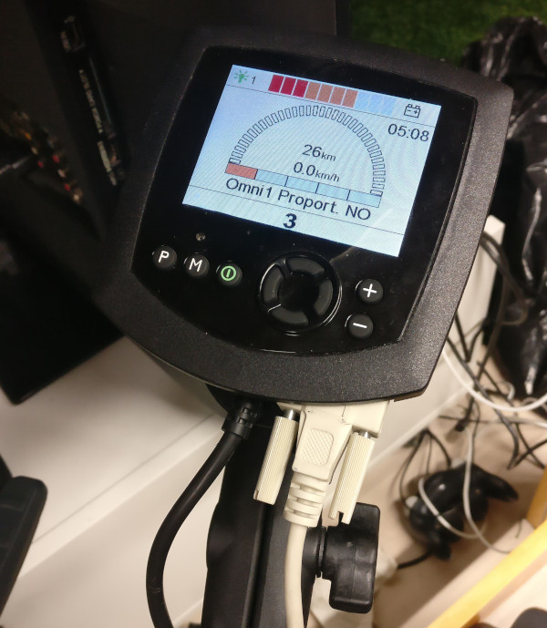

# Enjaksakavella

This is a project to control an electric wheelchair with custom controllers.

Project parts:
- Electronics connecting to wheelchair
- BLE-enabled Arduino driving the electronics
- Computer with software which handles:
  - BLE connection to Arduino
  - Connection to controllers
  - Visualizing controller working principles
  - Visualizing commands sent to wheelchair
- Custom controller(s)
  - Cap with eye-tracking camera

## Requirements

### Python Packages
- General (Qt)
  - PySide2
- Bluetooth on Linux
  - pydbus
  - python3-gi (from distribution repositories)
  - vext
  - vext.gi (for python3-gi)
- For Eyetracker controller
  - OpenCV2
  - numpy

### Arduino Libraries:
- ArduinoBLE

## Documentation

More documentation can be found in /doc folder

## Quick Start Guide
Using a laptop with linux and BLE-capable bluetooth

### Install software on computer

1. Clone the git repository

        git clone https://github.com/inkubio/enjaksakavella.git

2. Create a new virtual environment for the project and activate it

        cd enjaksakavella
        python3 -m venv .venv
        source .venv/bin/activate

    When running the program, remember activate this virtual environment first by running the activate script.
  

3. Install required software, with python packages in the virtual environment

    For Qt:

        pip3 install pyside2

    For DBus:

        pip3 install pydbus

    For DBus error handling use system's GObject Inspector since the packages can't be found on pip. First, ensure that you have python3-gi installed:

        sudo apt install python3-gi

    For compiling python modules:

        sudo apt install python3-dev

    For Qt wayland support:
        sudo apt install qtwayland5
    

    Then install vext package to use python3-gi

        pip3 install vext --no-binary :all:
        pip3 install vext.gi --no-binary :all:

    For Eyetracker: (opencv-python also installs numpy)

        pip3 install opencv-python

    For acceleration glasses:
        pip3 install phidget22

        Additionally, copy libphidget22.so from src/resources to /usr/lib/ and 99-libphidget22.rules to /etc/udev/rules.d, and after that log out and back in to use the added udev rules

    Check that you get something like this with `pip3 list` and the setup should be done.

        (.venv) tuomas@blini:~/Ohjelmointi/enjaksakavella/src$ pip3 list
        Package          Version 
        ---------------- --------
        numpy            1.18.2  
        opencv-python    4.2.0.34
        pip              18.1    
        pkg-resources    0.0.0   
        pydbus           0.6.0   
        PySide2          5.14.2  
        ruamel.yaml      0.16.10 
        ruamel.yaml.clib 0.2.0   
        setuptools       40.8.0  
        shiboken2        5.14.2  
        vext             0.7.3   
        vext.gi          0.7.0 

### Control the wheelchair
1. Connect the electronics to RNET OMNI's port 1
2. Turn on the wheelchair from RNET OMNI
3. Set control program to 3 from RNET OMNI
4. Run `main.py` in `src` folder
  - You may need to specify using Wayland on newer OS versions: `python main.py -platform wayland`
5. Select Bluetooth wheelchair and click connect
6. Select your favourite controller from the GUI
7. Enable desired movement(s) from the GUI
8. Move around without the need to use your legs

You should see this after step 3:

