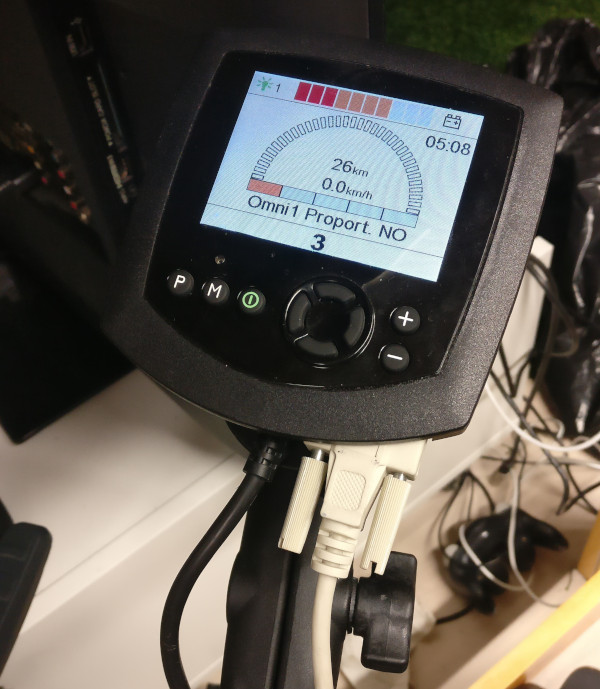
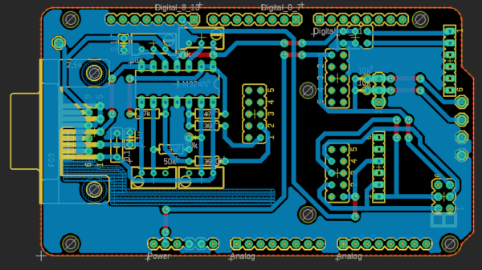

# Introduction - version 1.2

This project was started to create an easy to use interface for developing self-made controllers for an electric wheelchair. The system consists of three main parts: pcb for analog electronics and DAC, BLE-enabled Arduino controlling electronics on pcb, and computer or other BLE-enabled device controlling the Arduino.

## TL;DR user guide

1. Connect the electronics to RNET OMNI's port 1
2. Turn on the wheelchair from RNET OMNI
3. Set control program to 3 from RNET OMNI
4. Run `main.py` in `src` folder
5. Select Bluetooth wheelchair and click connect
6. Select your favourite controller from GUI
7. Enable the desired movement(s) from GUI
8. Move around without the need to use your legs

You should see this after step 3:

## Wheelchair

Wheelchair is a Puma 20 electric wheelchair with an RNET OMNI controller addon. The wheelchair has a speed cap of ~6km/h, because it is designed to work as a replacement for walking to the disabled, and not as a vehicle to move faster than normally on foot.

## System Description

The wheelchair has an RNET OMNI controller as an addon, installed by the company we bought the wheelchair from. The RNET OMNI controller has two ports which can be used to connect self-made controllers to the wheelchair. RNET OMNI provides power to the controller, and requires analog signals as control input.

A self-made adapter connects to the RNET OMNI. It translates a BLE GATT characteristic into controlling voltages for wheelchair. The system is built on a single pcb with headers to connect a DAC on a seperate board and an Arduino Nano 33 BLE. The board also has electrical connections for Arduino Mega, and it can also be used with Arduino Uno with few jumper wires. The Arduino Nano 33 BLE can be controlled with any BLE device. Its range is roughly 5 meters. 

Qt-based graphical user interface has been written to manage connection to wheelchair and controller, and to visualize controller functionality and driving commands sent to the wheelchair.

## Electronics

### Connection

The electronics are powered from RNET OMNI’s power output, which can supply 100mA at 12V. Our system’s peak current consumption is about 40mA. RNET OMNI is connected to our pcb with 9-pin female-female D-Sub cable. Pinout of the connectors are in figure below. Specifications for RNET OMNI can be found on its service manual, which can be found on Google with code SK78813/7. Relevant pages are 167-170.

What to connect and where:
  - Pin 1 and 2: At startup voltage level of pin 3 ±30mV. When driving, pin 3 ±1.1..1.3V
    - In plain words: 6V at startup, 4.8..7.2V when driving
  - Pin 3: Voltage at Pin 7 divided by 2 with threshold ±12mV
    - In plain words: 6V
  - Pin 5: Connected to ground
  - Pin 6: Not connected to ground. Seems to be used to control RNET OMNI's menus
  - Pins 7 and 8: These are used to power the pcb

  Other pins in our system:
  - Pin 4: Ground
  - Pin 9: Not Connected

Some error codes shown on RNET OMNI, for troubleshooting:
- 0808: Reference voltage out of bounds
- 0E00: Detect is not connected to ground OR Direction voltage out of bounds
- 0E02: Speed voltage out of bounds
- Joystick picture at startup: Speed/Direction voltages too far from 6V but not out of driving bounds

### PCB

All electronics are on a single pcb with form factor of Arduino Mega, including mounting holes (roughly 10 x 5.5 cm). The pcb has as well separated section for analog electronics as possible, with digital components and signals on the other end of the pcb.

Current mess:

Future PCB:

#### Components

- LM324 4x operational amplifier
- 4pc 50kOhm trim potentiometer
- 4pc 39kOhm resistor
- 3pc 100nF ceramic capacitors for signal/power filtering
- 9-pin D-Sub male connector
- ADC DAC Pi designed by AB Electronics UK
- Self-designed PCB for Arduino Nano 33 BLE, Arduino Mega, and with a few jumper wires also for Arduino Uno
  - For Nano 33 BLE:
    - 5pc 6x1 female headers
    - 2pc jumpers
    - 1pc 10kOhm resistor for emergency stop button’s pullup resistor
  - For Mega:
    - 6pc 6x1pin long female headers
    - 4pc 2x6 male header

#### Functionality
Arduinos are powered by 12V to their Vin pin. They are used to send commands to DAC over SPI bus. Arduinos are also used to generate 3.3V operating voltage for the DAC. The DAC outputs 2 channels of analog voltage between 0 and 2.048V. The DAC’s output signals are modified to match the wheelchair’s requirements by using a non-inverting amplifier with 4.8V offset voltage. Reference voltage for the wheelchair and the offset voltage are generated by a simple resistor divider. Trim resistors are used to get accurate values, and the voltages are buffered with a voltage follower. Gain of the amplifier is adjusted with trim resistors to get more accurate amplifying.

## Software
Software consists of two distinct pieces which interact with each other over BLE. One is on Arduino inside the controller, and the other one runs on a computer.

### Arduino Software
Arduino software is written using its regular tools (Arduino IDE) and C++. The software relies heavily on ArduinoBLE library. ADC DAC Pi:s Arduino library is not used because it is not ported to Mbed OS -based Arduinos. Instead, raw commands are sent over SPI. The software creates a single BLE GATT characteristic which can be written to. It accepts 2 bytes of data, of which the MSB is used to control forward/backward movement and the LSB controls turning right/left. If no new command is received within 0.5 seconds the wheelchair stops as a precaution. Serial connection to a computer can be used for debugging purposes.

### Computer Software
The computer software is written in Python and relies on Qt (PySide2) for GUI functionality. BLE is used over DBus with pydbus library. Different controllers can also use other libraries. The UI lets the user choose a connection method to the wheelchair, which controller to use, and allows disabling either one or both of turning or driving forward/backward. It also visualizes the commands sent to move the wheelchair. Space for controller UI is also embedded in the program, which can be used as the controller designer sees best.

#### Eye-tracking Controller
The eye-tracking controller consists of a cap with camera mounted to point at eye with infrared illumination. Infrared illumination is used because it creates a better contrast. The software uses blink detection to stop or drive forward with the wheelchair, and pupil tracking to detect pupil movements on horizontal axis to turn the wheelchair. You can calibrate again anytime after finding your eye, so if your pupil or blinking is not detected reliably enough, try moving the cap a bit and calibrating again.

##### Usage
- Connect the eye-tracking controller to the computer.
- Put the cap on your head with camera pointing to your eye.
- Click Find Eye -button until you can see your eye on the UI.
- Look forward and click the Calibrate -button. This tells the software at which position your pupil is looking forward so it doesn’t turn.
- If the vertical blue line does not go through your pupil, click calibrate until it does. Adjust the cap if needed.

#### Keyboard Controller
The keyboard controller uses keyboard arrow pad input to drive the wheelchair. It is visualized with big green arrow images which light up when the keys are pressed. If opposite keys are pressed (left+right or up+down), they are not used to move the wheelchair.

### Dummy Wheelchair Connection
This is a simple dummy which only prints the received commands on terminal output. Useful for testing controllers without moving the wheelchair.

### Bluetooth LE connection
This module runs currently only on Linux. It uses pydbus package to establish Bluetooth LE connection to the wheelchair and to send driving commands over DBus